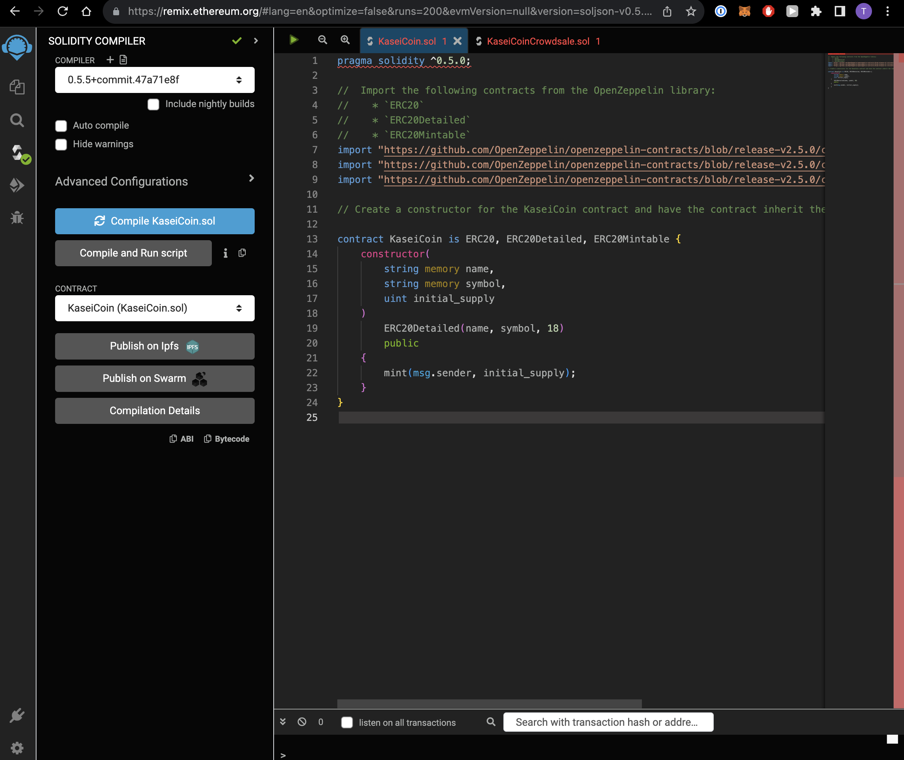
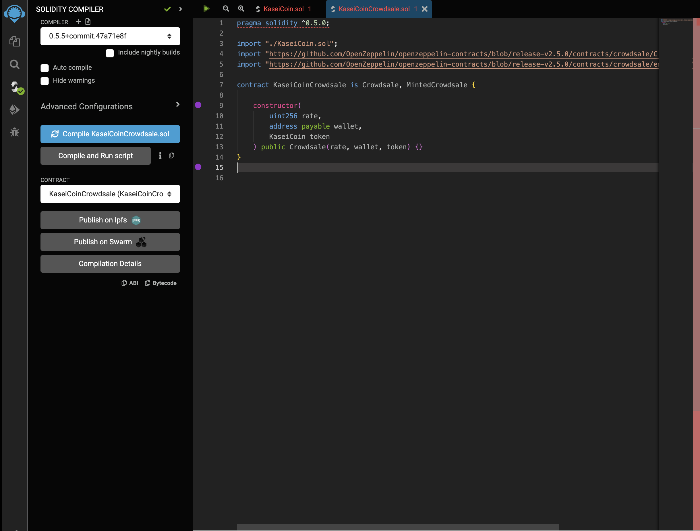
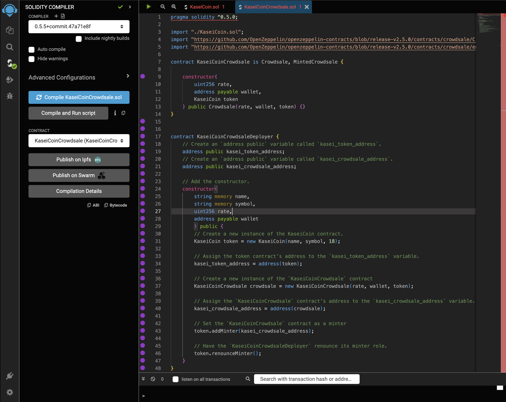
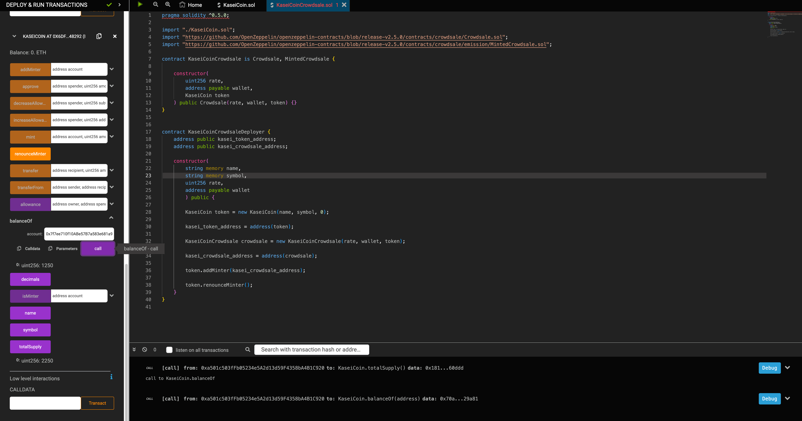

# Kasei Coin Crowdsale

## Folders

#### Code

- KaseiCoin.sol

- KaseiCoinCrowdsale.sol

#### Evaluation Evidence

- This folder contains screenshots of code compilation and deployment.

## How KaseiCoin Contracts work

* KaseiCoin.sol
  * This contract incorporates ERC20, ERC20Detailed and ERC20Mintable capabilities into the
    KaseiCoin contract to obtain and maintain the community standard of ERC Tokens.

* KaseiCoinCrowdsale.sol
  * This contract incorporates two contracts:
    * KaseiCoin Crowdsale
      * This incorporates the rate, wallet and KaseiCoin Token.
    * KaseiCoin Crowdsale Deployer
      * This incorporates token and crowdsale addresses.
      * Constructor with name, symbol, rate and wallet.
      * As well as mint functionality and renouncement. 
  

## Evaluation
* Complied KaseiCoin Contract

* Complied Crowdsale Contract

* Compiled Crowdsale Deployer

* KaseiCoin Balance Check

* Contract Deployment Demonstration

